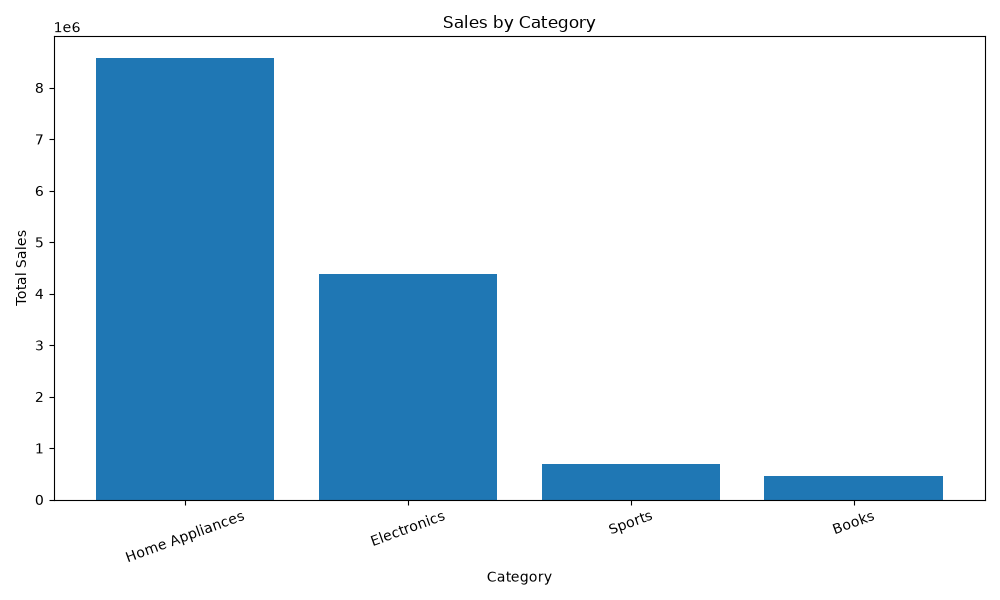
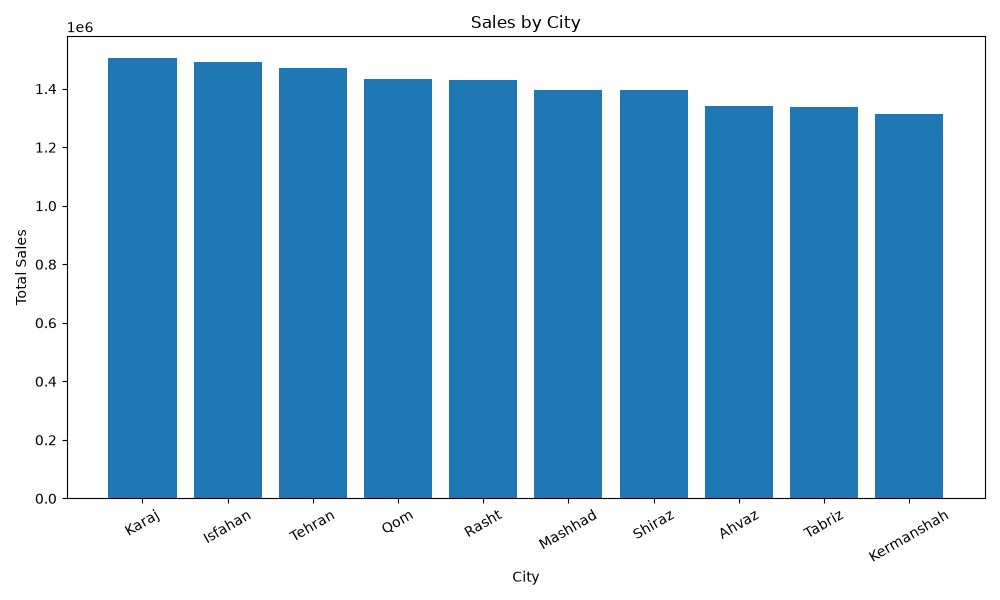
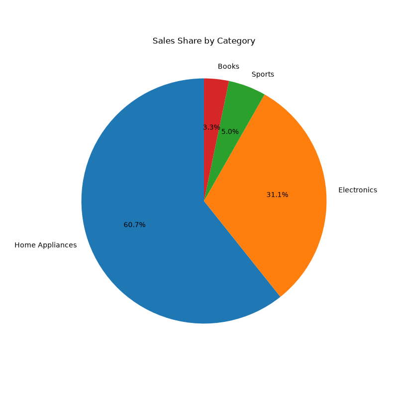
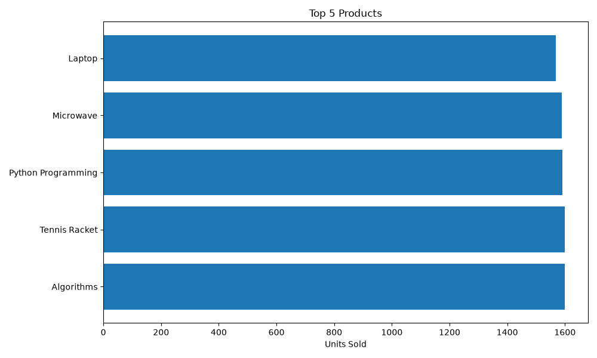

# Sales Data ETL and Analysis

A simple ETL pipeline built with Python.

The project generates synthetic sales data, cleans it, stores it in SQLite, runs a few SQL queries, and creates some basic charts.

## Tech Stack

- Python
- Pandas
- SQLite
- Faker
- Matplotlib

## Project Structure

```
src/
    generate_data.py
    etl.py
    database.py
    analysis.py
    visualization.py

data/
database/
reports/
```

## What each module does

- **generate_data.py** generates a random sales dataset and saves it as a CSV file.
- **etl.py** cleans the raw dataset, fixes data types, recalculates total prices, and writes the cleaned data.
- **database.py** imports the processed CSV into a SQLite database.
- **analysis.py** runs SQL queries for total sales, average order value, sales by city/category, and top-selling products.
- **visualization.py** creates charts from the database results.

## Running

```bash
python src/generate_data.py
python src/etl.py
python src/database.py
python src/analysis.py
python src/visualization.py
```

## Charts

### Sales by Category

<p align="center">
  
</p>

### Sales by City

<p align="center">
  
</p>

### Category Share

<p align="center">
  
</p>

### Top Products

<p align="center">
  
</p>

## Author

Armita Alimardani
